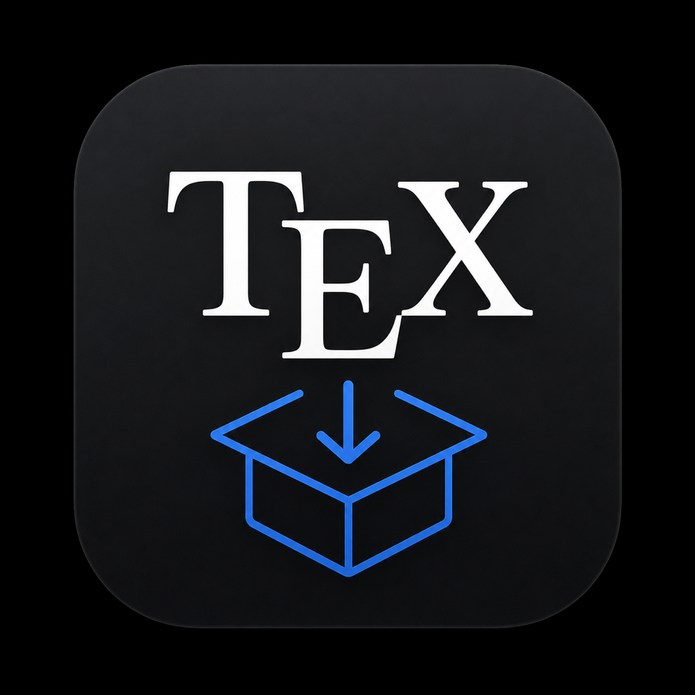

<div align="center">



# Knurl

**TeX diagnostics & package installer for macOS**

Drop your `.tex` project, find out what's missing, install it in one click.

[Website](https://gilsonolegario.github.io/knurl/) · [Download](https://gilsonolegario.github.io/knurl/Knurl.zip) · [Report a Bug](https://github.com/gilsonolegario/knurl/issues)


</div>

---

## Why

Missing LaTeX packages are the most common cause of compile failures — and the fix (`tlmgr install <name>`) is harder than it should be, because CTAN package names rarely match TeX Live package names. Knurl closes that loop: it reads your project, maps every `\usepackage` to the right TL package, and installs what's missing.

## Features

- 📄 **`.tex` project analysis** — drop a folder or the main file; Knurl maps document classes, packages (`\usepackage`, `\RequirePackage`) and engines in use
- 🔍 **Environment diagnostics** — detects your distribution (TeX Live, BasicTeX, Tectonic), active engines, broken or missing pieces
- 🗺️ **CTAN → TL mapping** — built-in overrides plus the [official TUG mapping](https://tug.org/~mseven/ctan-to-tl.tsv), so `tikz` resolves to `pgf` even when the name differs
- 📦 **One-click install** — missing packages installed via `tlmgr`, asking for admin privileges only when needed
- 📊 **Exportable reports** — full report as JSON or Markdown: environment, packages, actions taken
- ✨ **Native glass UI** — translucent window, floating sidebar, status tiles; built for Sequoia in light and dark mode

## Requirements

| | |
|---|---|
| OS | macOS Sequoia (15) or later |
| Hardware | Apple Silicon or Intel Mac |
| TeX | A TeX Live–based distribution for installs ([BasicTeX](https://www.tug.org/mactex/morepackages.html) works) |

## Install

1. Download [`Knurl.zip`](https://gilsonolegario.github.io/knurl/Knurl.zip) (~3 MB, universal binary)
2. Unzip and drag `Knurl.app` to `/Applications`
3. Right-click → **Open** the first time (see note below)
4. Drop a `.tex` folder onto the window

> [!WARNING]
> Builds are signed with a free Apple ID and are **not notarized** by Apple. On machines other than the signing one, Gatekeeper asks for confirmation once: right-click → Open, or `xattr -dr com.apple.quarantine Knurl.app`.

## Build from source

```bash
git clone https://github.com/gilsonolegario/knurl.git
cd knurl
swift build -c release          # debug: swift build
swift test                      # unit tests (KnurlCore)
swift run Knurl                 # run the app
```

Universal binary (Apple Silicon + Intel):

```bash
swift build -c release --arch arm64
swift build -c release --arch x86_64
lipo -create .build/arm64-apple-macosx/release/Knurl \
            .build/x86_64-apple-macosx/release/Knurl \
     -output Knurl-universal
```

Requires Xcode with the Swift 6 toolchain (SwiftPM package, tools version 6.0).

## How it works

The package has two targets:

| Target | Role |
|---|---|
| **KnurlCore** | Pure-logic library: project parsing, engine/distribution detection, CTAN→TL mapping, install planning, report building. Fully unit-tested, no UI dependencies |
| **Knurl** | SwiftUI app: glass-morphism UI, drop zone, log panel, admin privilege coordination for `tlmgr` |

Installations that need root go through a dedicated coordinator that shells out to `tlmgr` with explicit user consent — the app itself never runs privileged.

## Roadmap

- [ ] Show where each package was installed (TEXMF tree path) after a successful install
- [ ] "Reveal in Finder" action per installed package
- [ ] Display detected `TEXMFHOME` before installing
- [ ] Live CTAN→TL map updates from TUG with local caching

## Contributing

Bug reports and pull requests are welcome.

1. Fork and create a branch
2. Keep `swift test` green — new logic belongs in **KnurlCore** with tests
3. Open a pull request describing what changed and why

When reporting bugs, include: macOS version, TeX distribution (`tlmgr --version`), the `.tex` file (or minimal reproducer) and the app's log panel output.

## License

[MIT](LICENSE) © Gilson Olegario
